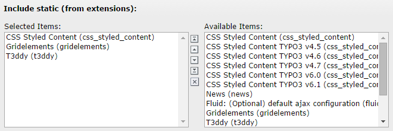
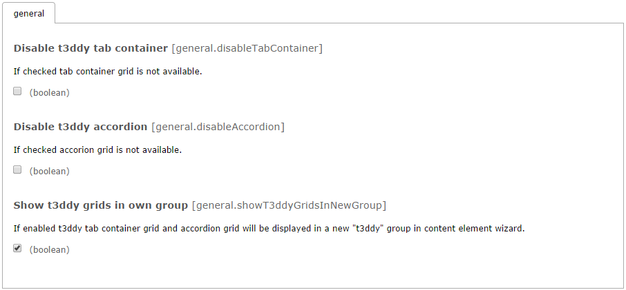

.. ==================================================
.. FOR YOUR INFORMATION
.. --------------------------------------------------
.. -*- coding: utf-8 -*- with BOM.

.. include:: ../Includes.txt

Installation
============

Requirements
------------

t3ddy requires the `gridelements extension <http://typo3.org/extensions/repository/view/gridelements>`_.

Static template inclusion
-------------------------

After t3ddy has been installed by extension manager the backend functionality works already.
But for the frontend it necessary to include the static templates of t3ddy to the current TYPO3 template.

*Include static (from extensions)*

.. important::

   t3ddy statics must be included **after** gridelements!

The static typoscript of t3ddy:

* Removes csc-default wrapping for item grids
* Includes frontend rendering typoscript for tab container, accordion container and items
* Includes jQueryUi library and css to frontend

To disable inclusion of jQueryUi and scripts just add this to your typoscript:

.. code-block:: typoscript

	page.includeCSS.jQueryUi >
	page.includeJS.jQueryUi >
	page.includeJS.t3ddy >

But then, you have to take care of tab/accordion functionality in frontend by yourself.

Options in extension manager
----------------------------

t3ddy also provide three options in extension manager:

*t3ddy options in extension manager*

+---------------------------------+-----------+----------+-------------------------------------------------------------------------------------------------------------------------+
| Title                           | Type      | Default  | Description                                                                                                             |
+=================================+===========+==========+=========================================================================================================================+
| Disable t3ddy tab container     | boolean   | 0        | If checked, tab container grid is not available.                                                                        |
+---------------------------------+-----------+----------+-------------------------------------------------------------------------------------------------------------------------+
| Disable t3ddy accordion         | boolean   | 0        | If checked, accordion container grid is not available.                                                                  |
+---------------------------------+-----------+----------+-------------------------------------------------------------------------------------------------------------------------+
| Show t3ddy grids in own group   | boolean   | 1        | If enabled, t3ddy tab and accordion container grid will be displayed in a new "t3ddy" group in content element wizard.   |
+---------------------------------+-----------+----------+-------------------------------------------------------------------------------------------------------------------------+