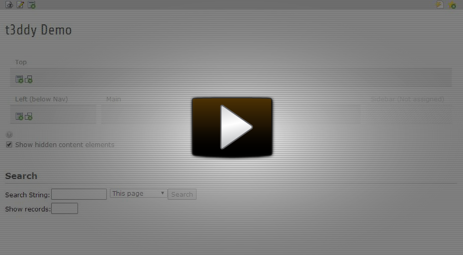
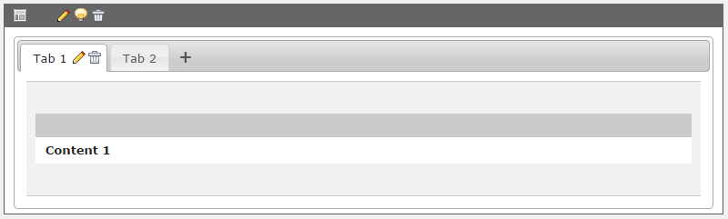
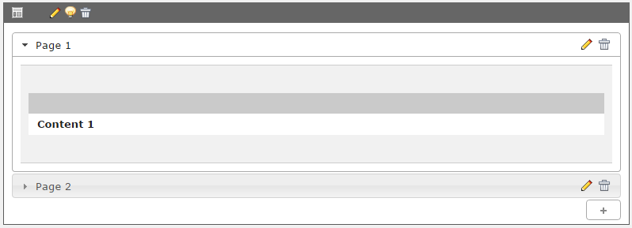
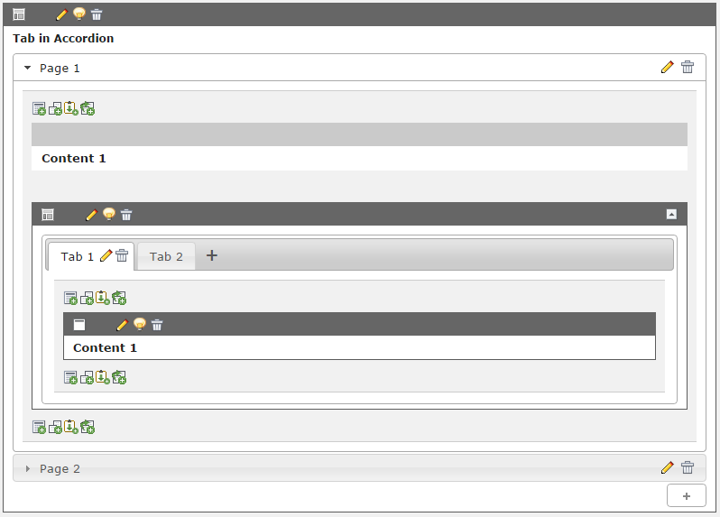
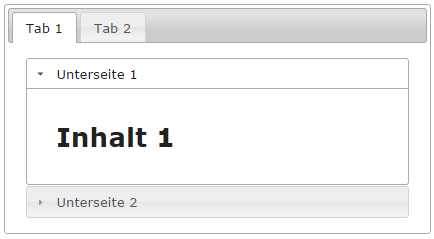

.. ==================================================
.. FOR YOUR INFORMATION
.. --------------------------------------------------
.. -*- coding: utf-8 -*- with BOM.

.. include:: ../Includes.txt

What does it do?
================

t3ddy provides comfortable tabs and accordion handling right in TYPO3 page module using the magic of gridelements.
Tabs and accordions may be nested. In backend you are also able to change the order of tabs/pages by drag and drop.

Demo videos
-----------

*Demo video of tab container*

*Demo video of accordion container*

Screenshots
-----------

*t3ddy Tab Container*

*t3ddy Accordion Container*

*Nested t3ddy Containers*

*Nested t3ddy Containers in Frontend using jQuery UI "Smoothness" theme*

How the extension works
-----------------------

Basically this extension provides three filebased grid elements:

* t3ddy tab container
* t3ddy accordion container
* t3ddy item

The *t3ddy item* are single tabs or accordion pages, depending in container type they are located.

Additionally the extension has a PageRenderer hook to inject javascripts and stylesheets to page module in TYPO3 backend.

t3ddy uses jQueryUi. The shipped jQueryUi version is a custom one containing these modules:

* Accordion
* Tabs
* Sortable
* Smoothness theme