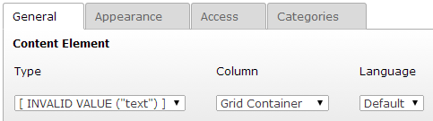

.. ==================================================
.. FOR YOUR INFORMATION
.. --------------------------------------------------
.. -*- coding: utf-8 -*- with BOM.

.. include:: ../Includes.txt

Support
=======

Bug tracker
-----------

t3ddy has a project on `TYPO3 forge <https://forge.typo3.org/projects/extension-t3ddy/issues>`_,
where you can report bugs, submit feature requests or ask requests (as support ticket).

Also you will find the code in `TYPO3 SVN <https://svn.typo3.org/TYPO3v4/Extensions/t3ddy/>`_, if you want to participate.

Known issue
-----------

Currently one issue is still unsolved: When creating t3ddy items (tabs or accordions in a container) and you click on
the "Save and create new entry" button in backend, this works just the first time. The second click on this button
let TYPO3 forget about the preset content element type.

*"Save and new" button bug when creating t3ddy items*

This seems to be a core bug in TYPO3, but I need to investigate further.